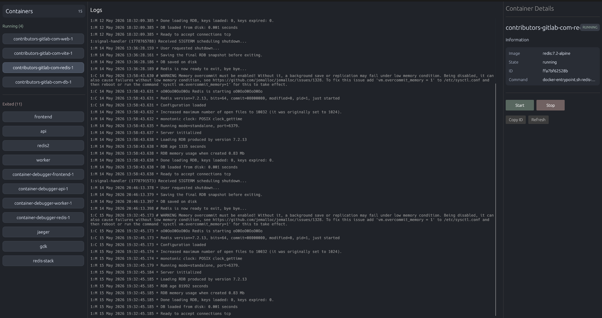

# 🐾 Genet — A Lightweight Docker Desktop Built in Rust

Genet is a native, low-latency Docker client written in Rust. It talks directly to `dockerd` over Unix sockets and renders a live-updating desktop UI with `egui`.

It is not a wrapper around `docker ps`.
It is a small Docker Engine client with live container state, container controls, and continuous log streaming.



---

## Current Features

- Live container list grouped by state
- Real-time container start/stop updates from Docker's `/events` stream
- Start and stop controls for containers
- Container detail panel with image, state, ID, and command
- Continuous container logs in the central panel
- Direct Docker Engine communication over `/var/run/docker.sock`
- Channel-based background work with no shared mutable UI state

---

## User Interface

Genet uses a three-panel layout:

- Left panel: running and exited containers
- Center panel: live logs for the selected container
- Right panel: container details and actions

Selecting a container starts a continuous log stream and keeps the central log view updated without blocking the UI.

---

## How Genet Talks To Docker

Genet sends raw HTTP requests over Docker's Unix socket:

```http
GET /containers/json?all=1 HTTP/1.0
GET /events HTTP/1.0
GET /containers/{id}/logs?stdout=true&stderr=true&follow=true&tail=200 HTTP/1.0
POST /containers/{id}/start HTTP/1.0
POST /containers/{id}/stop HTTP/1.0
```

Docker responds with:

- JSON for container list queries
- Newline-delimited JSON for Docker events
- Multiplexed stdout/stderr frames for container logs

The UI thread polls channels in `update()`, so Docker streams can keep running in background threads while the interface stays responsive.

---

## Why Genet Exists

Most Docker GUIs sit on top of the Docker CLI or high-level SDKs. Genet talks to the Docker Engine API directly, which makes it useful as both a real desktop tool and a systems-learning project.

The interesting parts are:

- Raw HTTP over Unix sockets
- Streaming Docker endpoints
- Manual log frame parsing
- Event-driven UI updates
- Rust channels for thread-to-UI communication

---

## Technology Stack

- Rust
- egui / eframe
- serde / serde_json
- Unix sockets
- mpsc channels
- Docker Engine API

---

## Roadmap

- Restart containers
- CPU and memory statistics (`/stats`)
- Container inspect view
- Image and volume management
- Multi-host support
- Windows named-pipe support

---

## Author

Built by **Parth Sharma** as a deep systems project exploring concurrency, networking, streaming APIs, GUI state synchronization, and Docker internals.
